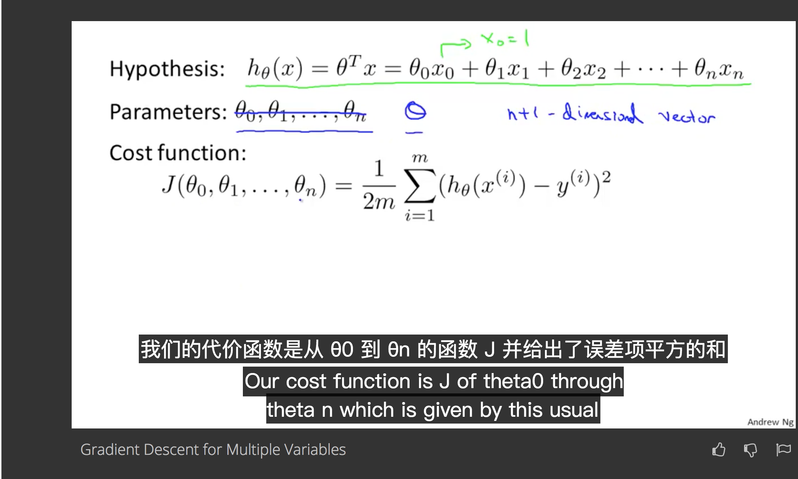

# coursera multi sub extension
让coursera支持多字幕

### 截图

### 安装方法

* 下载本插件
* 使用 Chrome 访问 chrome://extensions/
* 点击“加载已解压的扩展程序”
* 选择 extension 文件夹即可

### 使用方法

* 在视频页面点击该插件
* 点击 “点击获取当前视频语言“
* 选择需要显示的语言即可

### TODO

欢迎PR
